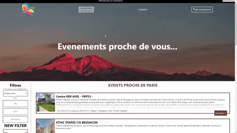

# 🚗PROJET MY_EVENT | ReactJS NodeJS📅
  
  ----------------  

  Ce projet a pour but d'utiliser une api externe qui regroupe des événements proches de chez vous.  
    
`Démarrer le projet :`  
```
Cloner le dépôt

dossier Front :
npm install
npm start

dossier Back :
npm install
npm start
```
<p align="center">
    
</p>